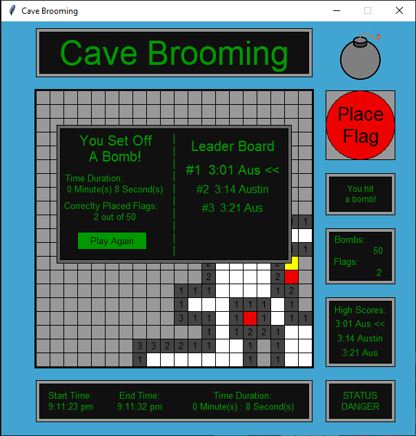
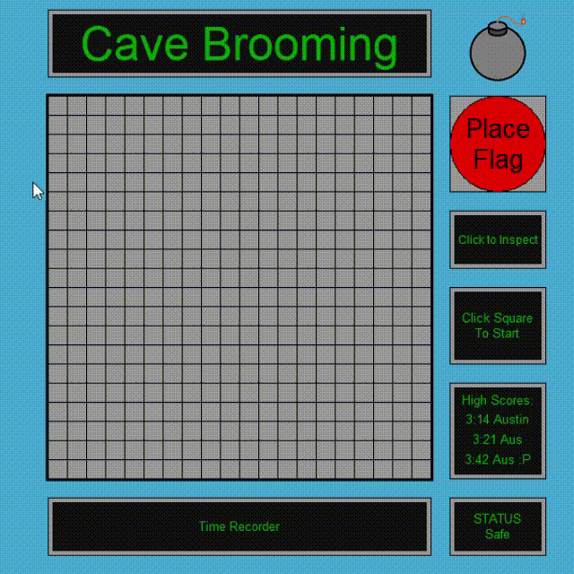

Austin Pipkins python project

**CAVE BROOMING**

This python projet was made on 6-9-19 as a personal project to test out the graphics package graphics.py

**How to play**

When initialized, there will be a large 20x20 grid.

To start, click anywhere on this grid to reveal your cave.

The white tiles represent the cave coordinates that dont have any surrounding bombs.

The gray number tiles represent spaces with at least one bomb in one of the surrounding spaces.

Your job is to explore the whole grid and flagging the bombs.

To flag a bomb, press the place flag button in the top-right, and click the suspected bomb location.

**Additional Features**

  Timer:
  
    This feature allows the player to see their current time and start time.

  High score board:
  
    Keeps track of the top the best times. The data for this feature is stored under msHighScore.txt
    
    Each high score winner gets to type in a name up to 6 characters long.
   
  Bomb and flag display box:
  
    Displays the number of flags that have been placed and the number of bombs on the board.
    
    *The total number of bombs will always be 50, as this is hardcoded, but can be changed.
    
    

**Video** 

 
**Picture of loss** 
 
   
     
  
     

